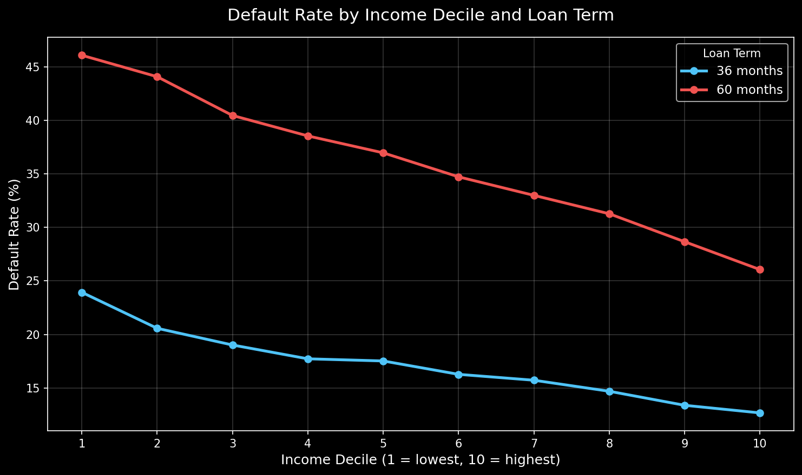
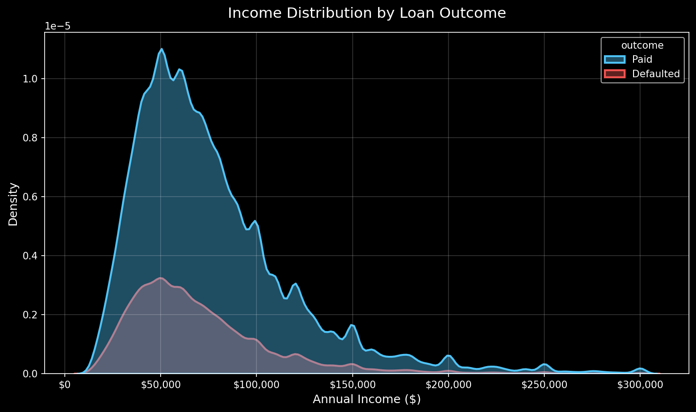
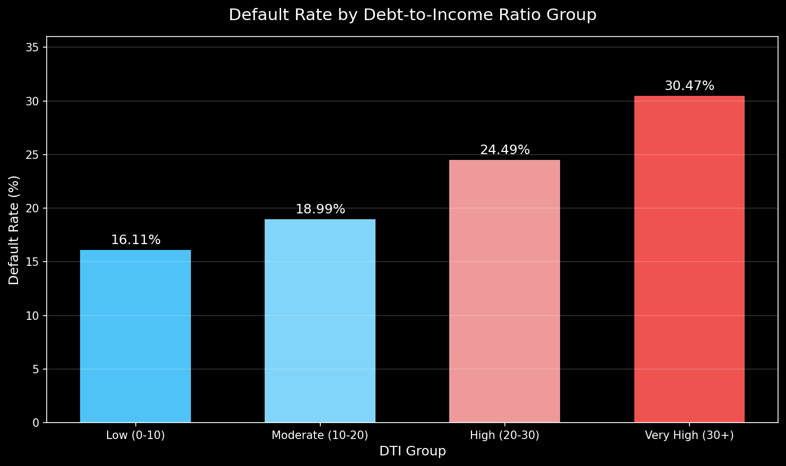
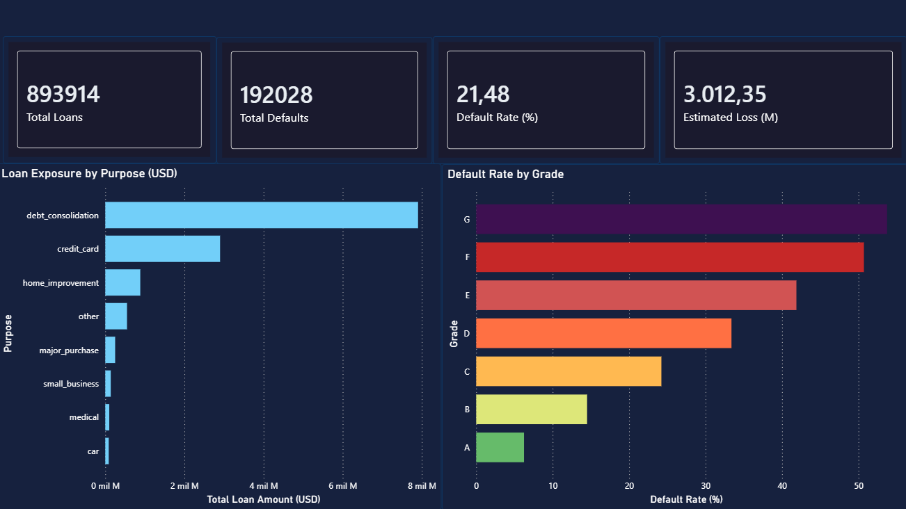
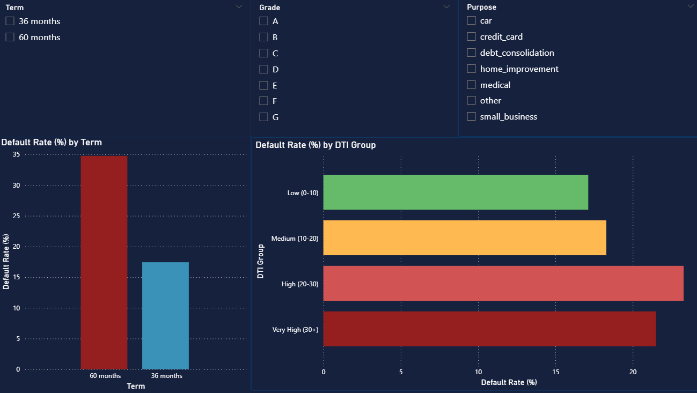

# Credit Risk Analysis — What Actually Drives Loan Default?

**Stack:** PostgreSQL · Python · Power BI  
**Dataset:** LendingClub 2015–2018 · 893,914 loans  
**Author:** Manuel — Statistics student, Universidad de Costa Rica


## Why I Built This

I am a statistics student in Costa Rica, and earlier this year I came across something in a Central Bank report that I could not stop thinking about.

The BCCR (Costa Rica's Central Bank) reported that loan delinquency kept rising between 2023 and 2025 — from 10.5% to 12.6% — even as the economy was doing well. Wages went up. Unemployment fell. Interest rates dropped. And yet, more people were defaulting on their loans.

The BCCR pointed to two possible explanations: people were taking on too much debt relative to their income, and longer loan terms were becoming more common.

That made me curious. Do those same patterns actually show up at the individual borrower level? And if so, which one matters more — how much money you make, or how long your loan is?

Since individual borrower data is not public in Costa Rica, I used LendingClub — a real U.S. consumer lending platform — as a proxy. The economic context is different, but the borrower-level dynamics are comparable enough to test the hypothesis.

> **Honest disclaimer:** LendingClub is a U.S. dataset. I am not claiming these numbers apply directly to Costa Rica. I am using them as a reference to explore whether the BCCR's hypotheses hold at the loan level.


## The Data and How I Cleaned It

The raw LendingClub dataset had over 2.2 million rows. After cleaning, I worked with **893,914 loans**.

The decisions I made during cleaning matter, so I want to be transparent about them:

- **Only kept loans with a definitive outcome** — fully paid or defaulted. Loans that were still active, late, or in grace period were excluded because we do not know how they end. Including them would have polluted the analysis.
- **Only kept 2015–2018** — data before 2015 has quality issues, and post-2019 loans are distorted by COVID. The 2015–2018 window gives a clean picture of normal lending behavior.
- **Used median instead of average** for income and DTI throughout. LendingClub has some borrowers reporting over $1 million in annual income. A simple average would misrepresent the typical borrower.

The target variable is `default_flag`: 1 if the loan was charged off or defaulted, 0 if fully paid.


## What I Found

### Finding 1 — Loan term nearly doubles default risk

60-month loans default at **34.75%**. 36-month loans default at **17.43%**.

That is not a small difference. Just by choosing a longer loan term, a borrower's default probability roughly doubles. This was the first signal that the BCCR's hypothesis about loan terms had something to it.

### Finding 2 — The result that surprised me most

I split borrowers into 10 income groups and compared default rates by loan term within each group. What I expected: higher income = lower default, and the two lines would converge at the top.

What actually happened: **the richest borrowers with a 60-month loan (26.16%) default at a higher rate than the poorest borrowers with a 36-month loan (23.94%).** The two lines never cross. Across every income level, 60-month loans consistently default more.

This suggests that loan term has a stronger and more persistent association with default than income level does.



### Finding 3 — Income barely separates defaulters from non-defaulters

If income were the main driver, we would expect very different income profiles between borrowers who paid and those who defaulted. The data shows the opposite — both groups have nearly identical income distributions, concentrated around $40,000–$80,000 per year.

Higher income helps, but it does not protect you from defaulting. This is consistent with what the BCCR observed: rising wages in Costa Rica did not prevent rising delinquency.



### Finding 4 — Over-indebtedness is the clearest risk signal

DTI (Debt-to-Income Ratio) measures how much of a borrower's monthly income was already committed to debt before taking this loan. A DTI of 30 means 30 cents of every dollar earned was already spoken for.

Borrowers with DTI above 30 default at **30.47%**. Borrowers with DTI below 10 default at **16.11%**. Nearly double.

This is the most direct measure of over-indebtedness in the dataset, and it aligns directly with what the BCCR identified as a key driver of delinquency in Costa Rica.



### Finding 5 — Credit grade works exactly as expected

Grade A borrowers default at **6.25%**. Grade G borrowers default at **53.74%**. Every step up the grade ladder adds meaningful default risk, with no exceptions. The grading system does its job.

### Finding 6 — Volume vs rate: not the same thing

Small business loans have the highest default rate at **32.33%**. But debt consolidation produces the largest estimated loss at around **$1.9 billion** — simply because of its massive volume. 80% of this portfolio is consumer credit.

This distinction between relative risk and systemic exposure is one of the most practical concepts in credit risk, and the data illustrates it clearly.

### Typical borrower profile

| | Defaulted | Paid |
|--|-----------|------|
| Median income | $60,000 | $67,000 |
| Median DTI | 20.28 | 17.49 |
| Had a 60-month loan | 37.81% | 19.42% |
| Most common grade | C | B |

The income difference is small. The DTI difference and the loan term difference are where the story is.


## Dashboard

Built in Power BI with two pages. Page 1 gives a portfolio-level overview. Page 2 lets you filter by term, grade, and purpose to explore the risk segmentation.

### Executive Summary


### Risk Segmentation



## Files

| File | What it contains |
|------|-----------------|
| `creditrisk.sql` | 7 SQL analyses with comments explaining each decision |
| `credit_risk_eda.ipynb` | Python notebook with 3 visualizations and markdown explanations |
| `credit_risk_analysis.pbix` | Interactive Power BI dashboard |
| `lending_club_clean.csv` | Not included (too large). Run the SQL script to generate it from the raw dataset. |


## Stack

```
PostgreSQL 15    Data cleaning and all 7 analyses
Python 3.14      Pandas · Seaborn · Matplotlib
Power BI         Interactive dashboard
```


*Third project in my data analytics portfolio. The goal was to go beyond running queries and actually tell a story with the data — one grounded in a real economic question.*
